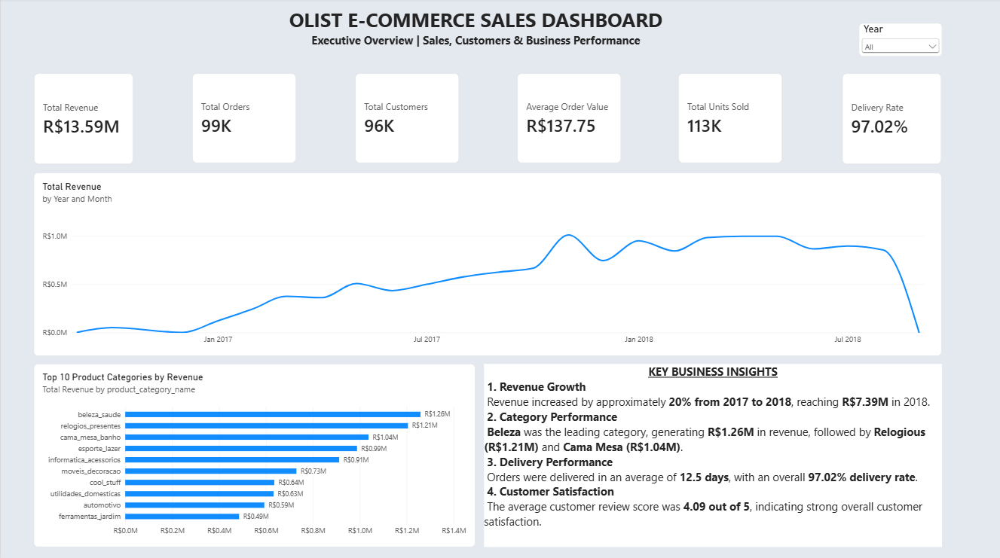
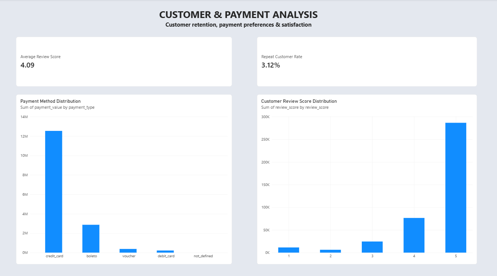
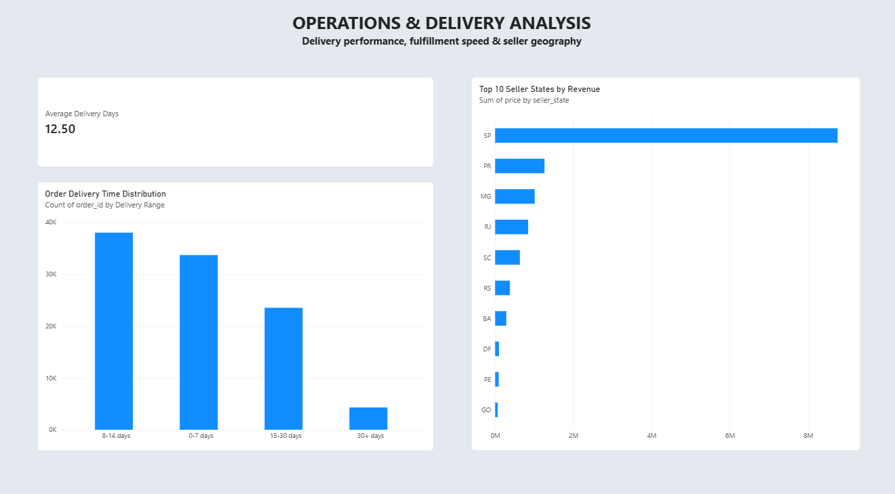
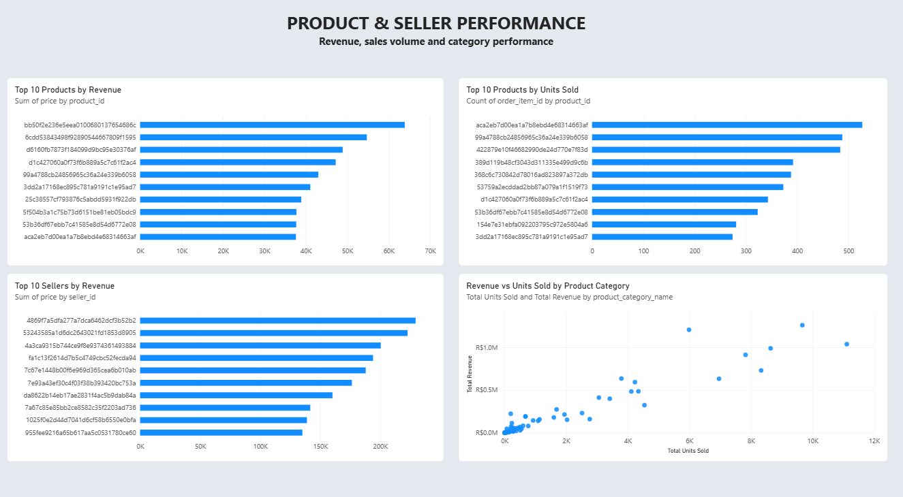

\# E-Commerce Sales \& Customer Intelligence Platform


\## 📊 Project Overview


The \*\*E-Commerce Sales \& Customer Intelligence Platform\*\* is an interactive Power BI analytics solution built using the Brazilian Olist e-commerce dataset.


The platform provides a comprehensive view of business performance across sales, customers, products, sellers, payments, reviews, and delivery operations.


\## 🎯 Business Objective


The objective is to transform raw e-commerce data into meaningful business insights that help stakeholders:


\* Monitor sales performance

\* Identify high-performing product categories

\* Evaluate seller performance

\* Understand customer behavior and satisfaction

\* Analyze payment preferences

\* Monitor delivery performance

\* Compare business performance across years


\## 🛠️ Tools \& Technologies


\* \*\*Power BI\*\*

\* \*\*DAX\*\*

\* \*\*SQL\*\*

\* \*\*Python\*\*

\* \*\*Data Modeling\*\*

\* \*\*Data Visualization\*\*

\* \*\*Business Intelligence\*\*


\## 📑 Dashboard Pages


\### 1. Executive Overview


Provides a high-level view of business performance through KPIs, revenue trends, category performance, and year-based filtering.


\### 2. Customer \& Payment Analysis


Analyzes customer behavior, review scores, repeat customers, and payment methods.


\### 3. Operations \& Delivery Analysis


Analyzes delivery performance, delivery time, and seller-state revenue distribution.


\### 4. Product \& Seller Performance


Analyzes top products, top sellers, sales volume, revenue contribution, and category performance.


\## 📌 Key KPIs


| KPI                   |     Value |

| --------------------- | --------: |

| Total Revenue         |  R$13.59M |

| Total Orders          |       99K |

| Total Customers       |       96K |

| Average Order Value   |  R$137.75 |

| Total Units Sold      |      113K |

| Delivery Rate         |    97.02% |

| Average Review Score  |    4.09/5 |

| Average Delivery Time | 12.5 days |

| Repeat Customer Rate  |     3.12% |


\## 💡 Key Business Insights


\* Revenue increased by approximately \*\*20% from 2017 to 2018\*\*, reaching \*\*R$7.39M\*\* in 2018.

\* \*\*Beleza\*\* was the leading category, generating approximately \*\*R$1.26M\*\* in revenue.

\* Orders were delivered in an average of \*\*12.5 days\*\*, with an overall \*\*97.02% delivery rate\*\*.

\* The average customer review score was \*\*4.09 out of 5\*\*.


\## 📈 Analytical Features


\* Interactive year-based filtering

\* KPI monitoring

\* Revenue trend analysis

\* Product and seller ranking

\* Customer review analysis

\* Payment method analysis

\* Delivery performance analysis

\* Cross-visual interactions

\* Business insight generation


\## 📂 Dataset


This project uses the \*\*Brazilian E-Commerce Public Dataset by Olist\*\*.


The raw CSV files are \*\*not included in this repository\*\*. They are excluded to keep the repository focused on the analysis and dashboard while respecting the dataset's usage conditions.


\## 🚀 Project Outcome


This project demonstrates how \*\*Power BI, DAX, SQL, and Python\*\* can be used to transform e-commerce data into an interactive business intelligence platform for performance monitoring and data-driven decision-making.


\## 👤 Author


\*\*Gaurav Raj\*\*


B.Tech CSE | Aspiring Data Analyst


\*\*Skills:\*\* Power BI · DAX · SQL · Python · Data Analysis · Data Modeling · Data Visualization · Business Intelligence


## 📸 Dashboard Preview

### Executive Overview


### Customer & Payment Analysis


### Operations & Delivery Analysis


### Product & Seller Performance



## 📁 Project Structure

```text
├── Notebooks/       # Python analysis scripts
├── SQL/             # SQL queries
├── charts/          # Generated visualizations
├── screenshots/     # Power BI dashboard previews
├── Data/            # Local dataset (not uploaded)
└── ecomerce_project.pbix


🔍 Key Business Questions
How is revenue changing over time?
Which product categories generate the most revenue?
Which sellers and states perform best?
What payment methods do customers prefer?
How satisfied are customers?
How long does delivery take?
What is the overall delivery performance?
📊 Dashboard Highlights

The Power BI dashboard provides interactive analysis through:

Executive KPI monitoring
Revenue and order trends
Category performance
Customer and review analysis
Payment analysis
Seller and state performance
Delivery-time analysis
Year-based filtering
🧰 Skills Demonstrated

Data Analysis: Python · Pandas · Exploratory Data Analysis

Database: SQL · MySQL · Data Querying

Business Intelligence: Power BI · DAX · Data Modeling

Visualization: Power BI · Matplotlib · Business Charts
